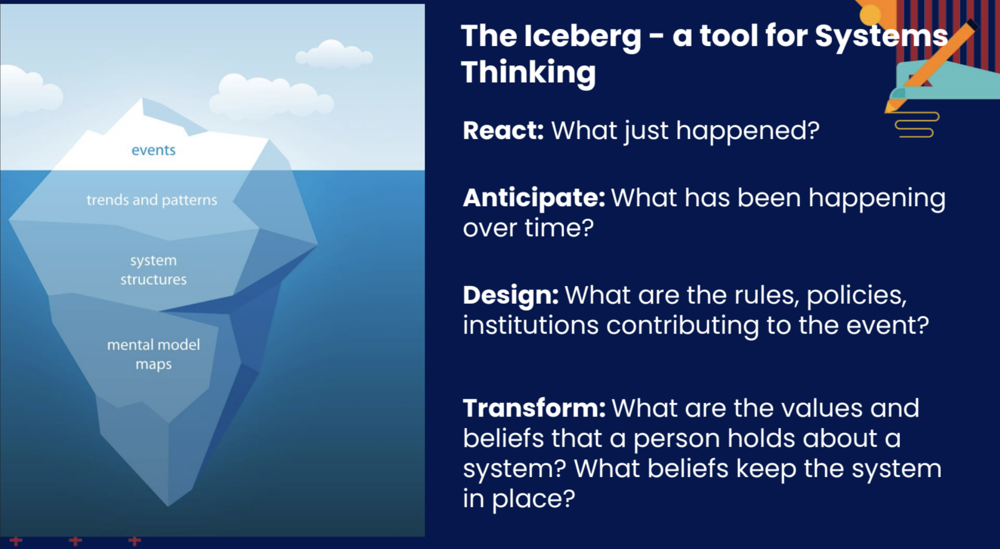

# Design Thinking Process - Somalia Neonatal Health

## Purpose of This Document

This document captures our structured thinking process, showing how our focus
evolved from a broad health landscape to specific, high-impact neonatal
research questions.

---

## **Divergent–Convergent Thinking**

### **Phase I – Divergent Thinking**

We began with an open exploration of Somalia’s health challenges, guided by a
field expert's interest in making a real impact in Somalia.

Our three **initial health pillars** were:

- **Infectious Diseases & Non-Communicable Diseases (NCDs)** -
- **Malnutrition** –
- **Child Vaccination & Mortality** –

Within these pillars, we brainstormed questions such as:

---

### **Phase II – First Convergence: Maternal Health**

Maternal mortality exceeds 800 per 100,000 live births, nearly 40 times the
SDG target.

We initially converged on **maternal health** for three reasons:

  1. **Urgency** – Somalia's maternal mortality ratio is among the highest
   globally (estimated > 800 deaths per 100,000 live births).  

  2. **Data Availability** – SHDS 2020 provides indicators on antenatal care,
   delivery conditions, and FGM prevalence.

Our **first problem statement** was:
> *What are the patterns of postpartum infections among Somali women without
postnatal care within 2 days, and how do these patterns correlate with maternal
mortality outcomes?*

---

### **Phase III – Second Convergence: Neonatal Pivot**

Deeper review of **SHDS 2020** and
**WHO–Somalia Country Cooperation Strategy (2021–2025)** highlighted:

- **Neonatal deaths** account for ~40% of all under-five deaths in Somalia.

- Stronger data coverage for neonatal outcomes than for postpartum
  infection (which suffers from survivor bias).  
  
- Documented causal pathways between
  **FGM severity, prolonged/obstructed labour, and neonatal birth trauma**.  
  
- Clear geographic and socio-political patterns in neonatal mortality that
  could be mapped.

This led to our **final research questions**:

  1. **Hotspots** – Are there geographic hotspots where neonatal mortality
         and morbidity cluster?
  
  2. **FGM Severity** – How does the severity at which FGM is performed
         influence neonatal health outcomes?
  
  3. **Conflict Disparities** – Are there disparities in neonatal mortality
     linked to socio-political instability (e.g., conflict zones vs. stable regions)?

---

## ❄ Iceberg Model - Neonatal Mortality in Somalia

### **Event (Tip of the Iceberg):**

- Somalia’s neonatal mortality rate remains among the **highest globally**
  with regional clustering and strong links to conflict intensity, facility
  access, and maternal health practices.

- Severe forms of **FGM (Type III/infibulation)** are associated with
  prolonged/obstructed labor, higher risk of stillbirth, and early neonatal death.

---

### **Trends & Patterns (Below the Surface):**

- **Geographic clustering:** Rural, conflict-affected, and IDP settlements
  report the highest neonatal mortality and lowest skilled birth attendance.

- **Severe FGM prevalence:** More common in rural/traditional areas,
  correlated with difficult labor, birth trauma, and low Apgar scores.
- **Conflict-linked disparities:** Reduced immunization coverage, medicine
 shortages, and interrupted neonatal care in high-insecurity zones.
- **Cultural preference for home births:** Leads to delays in seeking
  facility care during neonatal emergencies.
- **Nutrition-related vulnerability:** Maternal and neonatal malnutrition
  increases susceptibility to infection and worsens recovery.

---

### **System Structures (Deep Causes):**

- **Weak health system capacity:**
  - <30% of facilities provide comprehensive emergency obstetric and newborn
  care (EmONC).
  - Private sector fills service gaps but is unregulated and inequitable.
  - Referral systems in rural/conflict zones are often non-functional.
- **Human resource shortages:**
  - Critical shortage of midwives/skilled attendants -> concentrated in urban centers.
  - Training quality inconsistent due to absence of a standardized national curriculum.
- **FGM as a societal norm:**
  - 76% of women aged 15–49 support continuation of the practice.
  - Milder forms often misperceived as harmless.
- **Conflict and displacement:**
  - Damaged infrastructure, population movements, and humanitarian access
  restrictions reduce neonatal service delivery.
- **Data gaps:**
  - Weak birth/death registration; many neonatal deaths unrecorded,
  especially in home births.

---

### **Mental Models (Root Beliefs Holding the System in Place):**

- **Cultural entrenchment of FGM:** Seen as essential for moral purity and marriageability.
- **Acceptance of neonatal loss:** Infant deaths normalized in high-fertility,
  high-mortality contexts.
- **Trust in traditional over biomedical care:** Community birth attendants
  preferred over trained professionals.
- **Conflict as the "normal" environment:** Persistent insecurity seen as
  inevitable, lowering expectations of consistent health services.

---

### **Malnutrition ↔ Neonatal Disease**

💡 **Two-way relationship between maternal/infant nutrition and neonatal health outcomes:**

🥚 **Cause:**  
Poor maternal nutrition leads to low birth weight and compromised newborn immunity.

- **Protein-energy malnutrition** in mothers → intrauterine growth restriction.
- **Micronutrient deficiencies** (iron, zinc, vitamin A) → increased risk of
  neonatal infections.
- Malnourished newborns are more vulnerable to:
  - Sepsis
  - Pneumonia
  - Neonatal tetanus

🐔 **Result:**  
Neonatal illness further weakens feeding and nutrient absorption.

- Infections cause nutrient loss and reduced breastfeeding effectiveness.
- Hospital-acquired infections during prolonged labor or C-section increase
  metabolic demands while reducing intake.

---

## References

[Country Cooperation Strategy for WHO and Somalia 2021–2025](https://applications.emro.who.int/docs/9789290211280-eng.pdf)

[Renewing the fight against maternal and new-born mortality in Somalia](https://somalia.unfpa.org/en/news/renewing-fight-against-maternal-and-new-born-mortality-somalia)

[Female Genital Mutilation is still widespread in Somalia](https://euaa.europa.eu/report-female-genital-mutilation-still-widespread-somalia)

[Somalia Fertility Rate (1950-2025)](https://www.macrotrends.net/global-metrics/countries/som/somalia/fertility-rate)
