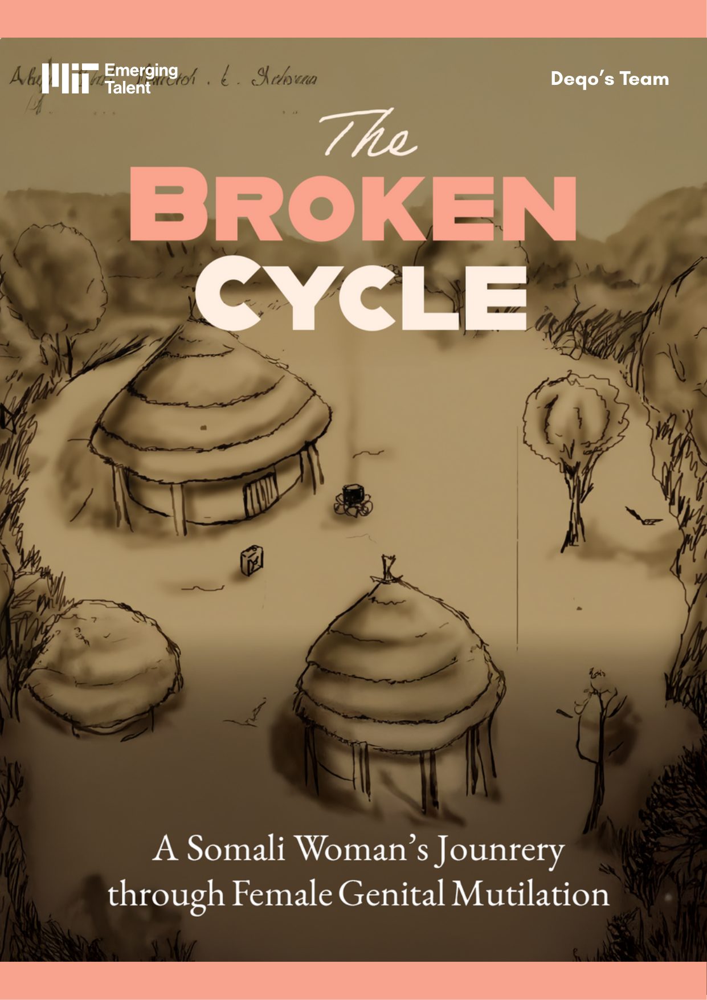
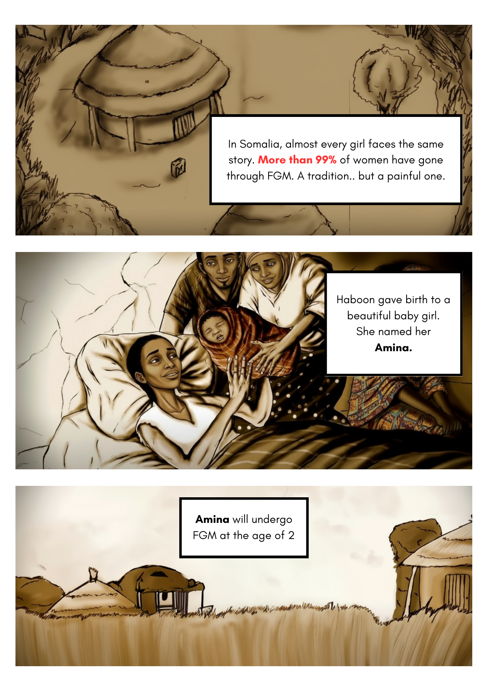
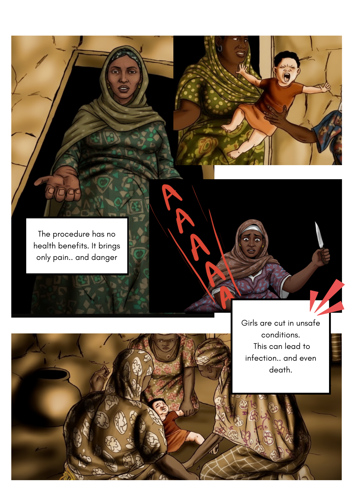

# Final Presentation - Group Deqo

## Presentation Focus

Building on our comprehensive analysis of the Somalia Health and Demographic
Survey (SHDS) 2020 dataset, the focus of the presentation centers on maternal
and child health, particularly the quantified impact of Female Genital Mutilation
(FGM) on newborn mortality through rigorous statistical modeling.

## Script Summery

Somalia suffers from alarming health crises, including the worst child survival
rate, highest maternal deaths, and highest FGM prevalence worldwide.
The research highlights the types of FGM, especially type III (infibulation),
which correlates with higher cesarean section rates, though most Somali women
give birth at home, leading to significantly higher newborn mortality. Child
deaths in Somalia cluster in specific regions, and paradoxically, children
seeking healthcare show higher mortality, possibly due to late-stage care or
data reflecting only those who access facilities. Awareness is identified as the
primary barrier to change given Somalia’s high illiteracy and limited internet
access. To address this, the team created a comic book using expressive imagery
to inform all literacy levels about alternatives to FGM, aiming to spark
reflection rather than force change. The project concludes with a video teaser
illustrating the personal story of a Somali woman shaped by FGM, emphasizing
the cycle of trauma and the potential for breaking it. Feedback highlighted the
importance of framing maternal and child mortality together and noted that
behavior change is a gradual process starting with awareness.

## Key Insights

- 🚼 **FGM’s direct impact on newborn mortality:** Infibulation physically
obstructs the birth canal, increasing cesarian section risks; however, the
predominance of home births obscures the true scale of complications and
mortality, underscoring the critical need for improved maternal care access and reporting.

- 🌍 **Spatial clustering of child deaths reveals systemic inequalities:** The
concentration of high mortality areas suggests localized factors such as poor
health infrastructure, access barriers, or socio-cultural practices, which must
be targeted by interventions rather than a one-size-fits-all approach.

- 📈 **Paradox of higher mortality among children seeking care:** This anomaly
likely reflects delayed or inadequate treatment, or the fact that sicker
children are more likely to access clinics, highlighting the need to improve
early health intervention and community outreach.

- 📵 **Barriers to awareness and education:** With limited literacy and internet
access, traditional digital campaigns may fail, requiring culturally appropriate
, accessible communication forms like comics to initiate behavior change.

- 🧩 **Behavior change as a multi-step process:** Awareness is only the first
necessary step; changing entrenched cultural norms around FGM requires sustained
community engagement and broad support, including addressing influential figures
such as mothers-in-law

## Data Science Innovation: Evidence-Based Health Communication

The Broken Cycle isn't just our research output, it's our primary vehicle for change.
This comic book transforms complex FGM data into accessible visual narratives
that can reach communities where traditional academic reports cannot.

## Final Presentation Materials  

🖼️ [**Final Presentation Slides**:] (./Presentation.pdf)

🎥 [**Presentation Recording**](https://youtu.be/LJJLY6NtT3s)

📖 [**The Broken Cycle Comic Book**:] (./TheBrokenCycle.pdf)

## Comic Highlight  

  
*Amina’s early childhood, where the cycle of FGM begins.*  

  
*The painful teenage years and lifelong health consequences.*  

  
*Breaking the cycle: Amina chooses a different path for her daughter.*

---
*This should showcase how creative methodologies can amplify the
 impact of collaborative data science beyond academic circles.*
